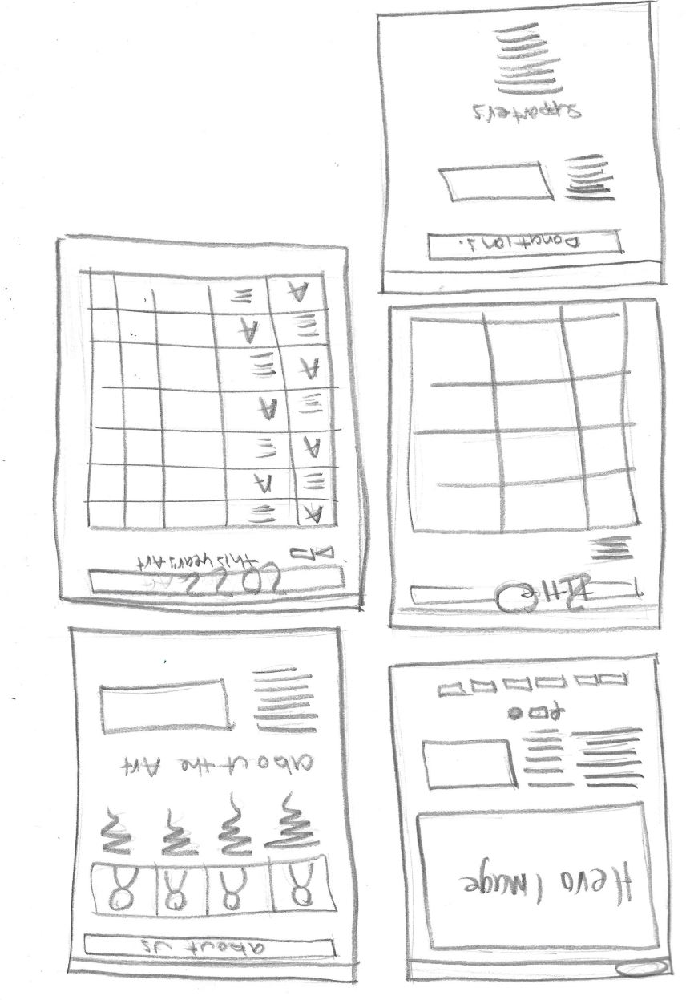

Reflection:
Through this assignment, I feel as though my coding knowledge has improved and been reinforced, even if it is just a small amount. I feel as though my basic understanding has improved in making a website. The main thing that has clicked for me in this assignment is the proper understanding of linking and having the correct linking tracks for images and connecting pages. I also feel as though my CSS styling understanding and thus practice has improved, this stems from my better understanding of divs and classes in HTML and how they transfer over to CSS. With CSS, I’m still unsure about many styling problems and how to solve them. I believe this comes from my lack of full understanding of code and how coding works. I struggle knowing what a piece of code actually does to the website, and then how to manipulate that to do what I intend. I would like to have a deeper understanding of coding to be able to fix the problems I run into frequently, or at least know how to express them to google for help. I still struggle with the understanding and code of grids and flexboxes. I also struggled with understanding media queries and how to maximise their use. Whilst I do have a responsive website, I did hold my final product to a higher level – but I now believe that to be an unrealistic level for myself. Overall, I generally found myself more confused about the code than knowing what I was doing and how to execute it. In this assignment, I definitely learned more about code, but ultimately, I learned more about my abilities in coding.

 
Low-fi pictures & discussion:
In my low-fi drawing, I looked at making the old site more practical. The first thing I did was combine a few of the pages together so there were fewer tabs in the navigation; i.e combining the supporters and donations pages.
Within the final website, some of the low-fi ideas were implemented, the combination of the donations and supporter’s page. Another was the general layout of the home page with the hero image and text and image separating the rest.
Some things that changed from the draft drawings were the layout of the arts in previous years -  I did want the art in a grid, ideally with some info about each, but this did not occur in the final website. The art is structured in a grid, but only 2 columns across and one column with the media queries. I also did not include information about each art piece.
The layout of the about us page is also different, I changed this as more people on this original page needed to be included. Instead, I listed the photo next to their blurb cantered to the page, allowing viewers to scroll down.
Most of these changes were due to the restrictions of my coding knowledge and the practicality of each element once on screen.

 
References:
https://floriadeaustralia.com/ - I enjoyed how the home page has been formatted. Not a major fan of the hamburger menu. 
https://nga.gov.au/ - liked the slide up of the home page. Didn’t like how the art displayed in grids are not aligned or even. 
https://www.folkfestival.org.au/ - liked the header and tabs design, however it was not very flexible or well responsive when screen size changed. 
https://www.artsy.net/ - many of theses art sites look like news websites and are overcrowded.  I do enjoy the small reels of art work on the main page. 

